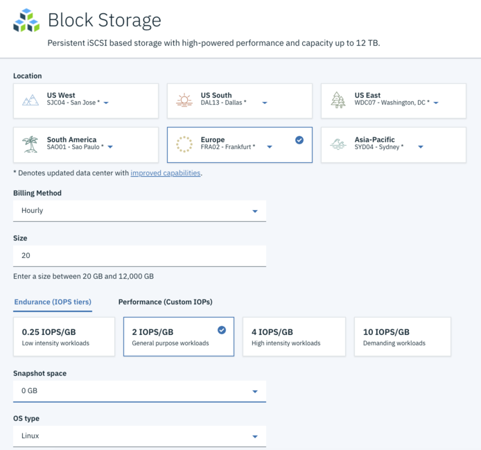
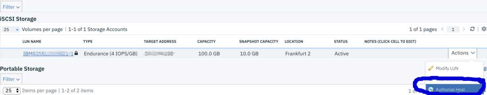
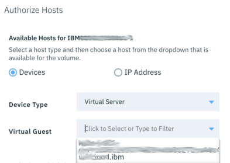
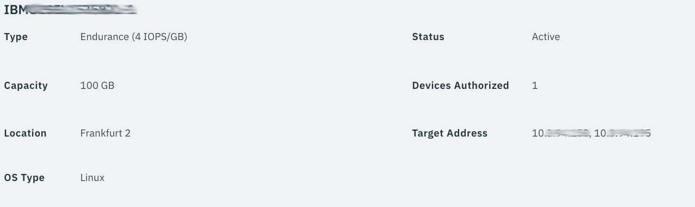
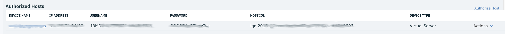
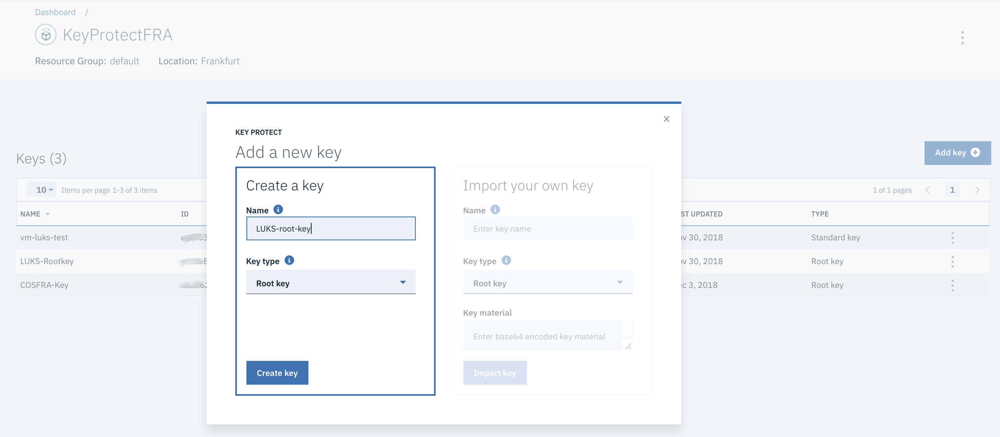
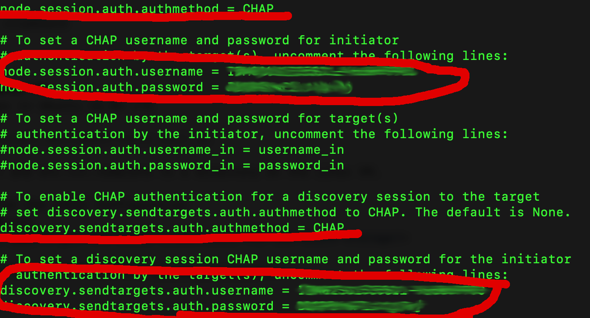
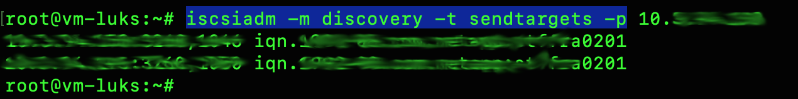

# LUKS Encryption with IBM Cloud Block Storage and IBM Key Protect
This is a basic example for IBM Key Protect with IBM Cloud Block Storage.
- [Overview](#Overview)
- [Architecture](#Architecture)
- [Requirements](#Requirements)
- [Installation](#Installation)
  * [Order IBM Block Storage in the IBM Cloud portal](#1-order-ibm-block-storage-in-the-ibm-cloud-portal)
  * [Authorize the VM for the Block Storage](#2-authorize-the-vm-for-the-block-storage)
  * [Get the iSCSI credentials for IBM Block Storage](#3-get-the-iscsi-credentials-for-ibm-block-storage)
  * [Configure IBM Key Protect](#4-configure-ibm-key-protect)
  * [Configure iSCSI on Linux VM](#5-configure-iscsi-on-linux-vm)
  * [Create Partition on device](#6-create-partition-on-device)
  * [Create, mount and umount encrypted LUKS Partition] (#7-create-mount-and-umount-encrypted-luks-partition)
  

## Overview

This example shows:
- Configuring Block Storage in IBM Cloud to be used by a Virtual Machine based on Ubuntu Linux 16.04 LTS  
- Mounting IBM Cloud Block Storage with multi-path tools
- Encrypting the block device with LUKS using enveloped Data Encryption Keys from IBM Key Protect.
- Understanding of basic curl and shell scripting
- Using the IBM IAM Token API and IBM Cloud Key Protect API


## Architecture
TODO: include picture

The Block Storage Device will as iSCSI using multi-path tools in Ubuntu. The configuration and principle is described in the following guides:
- [Mounting Block Storage in IBM Cloud][1]
- [Configuration of iSCSI in Ubuntu Linux][2]

Once properly configured the Block Storage Device will be used to create a partition table and partition to be accessible by the Operating System.
In IBM Key Protect a custom Root Key is defined, Root Keys could never leave the HSM Box behind the service. With this Root Key a Data Encryption Key DEK is created via API Call. This unwrapped DEK is passed to cryptsetup luksFormat to create an Encrypted LUKS Partition. The DEK is also returned as wrapped DEK which could only be unwrapped by the Root Key stored in Key Protect and the call to the Keyprotect API. This wrapped DEK is stored on the Filesystem in a text file. After the encrypted partition is created a normal EXTFS4 Partition is created into that partition.
To mount the enycrypted partition we need the unwrapped key data for an API Call to unwrap (decrypt) the DEK with the Root Key. The unwrapped Key is passed to cryptsetup luksOpen. This concept is called [Envelope Encryption][3]

## Requirements
- Full IBM Cloud account with IaaS permission to provision block storage and virtual machines.
- An existing Virtual Machine with Ubuntu Linux 16.04 LTS in the IBM Cloud accessible via ssh with public and private network connection. For this example a small machine is enough. 

## Installation
### 1. Order IBM Block Storage in the IBM Cloud portal

Order some Block Storage in the same Data Center Location where your VM resides.



### 2. Authorize the VM for the Block Storage





This will create access credentials.

### 3. Get the iSCSI credentials for IBM Block Storage
On the details Page of the IBM Block Storage you will  find the following Information.
- The target IP Addresses of the iSCSI Provider



- Username
- Password
- Host IQN  (iSCSI qualified name)
Please note down that information for later



### 4. Configure IBM Key Protect
Create a new Instance of IBM Key Protect in your IBM Cloud Account and add a new **Root Key** and note the Root Key Id, Root Keys never leave the Key Protect Service



Copy the Root Key Id to the clipboard


### 5. Configure iSCSI on Linux VM
Install the required packages in Ubuntu 16.04 LTS
```shell
apt-get update && apt-get install multipath-tools curl jq
```
Edit the following 2 Files for the iSCSI Configuration
- /etc/iscsi/initiatorname.iscsi
InitiatorName=<IQN from Step [3](#3-get-the-iscsi-credentials-for-ibm-block-storage)>
- /etc/iscsi/iscsid.conf

Chap Settings for details refer to the following [Documentation][1], see example screenshot.



Restart the required services to make the configuration active.
```shell
systemctl restart  iscsid
systemctl restart  open-iscsi
```
Do a discovery one one of the IP Addresses from Step [3].
```shell
iscsiadm -m discovery -t sendtargets -p <IP Address>
```



Now the following command should display a dev mapper device pointing to your iSCSI Blockstorage, the GUID will different.
```shell
ls -d /dev/mapper/*
==>
/dev/mapper/3600a098038304749775d4c4e554b7742
```

### 6. Create Partition on device
Use fdisk to create a new GPT Partition Table and a new Linux Partition on the Block device.
```shell
fdisk /dev/mapper/3600a098038304749775d4c4e554b7742
==>
Command (m for help): g
Created a new GPT disklabel (GUID: CB7582D5-A8F7-4868-BA25-9A721FC15CD2).
Command (m for help): n
Partition number (1-128, default 1): 
First sector (2048-209715166, default 2048): 
Last sector, +sectors or +size{K,M,G,T,P} (2048-209715166, default 209715166): 
Created a new partition 1 of type 'Linux filesystem' and of size 100 GiB.
Command (m for help): w
The partition table has been altered.
Calling ioctl() to re-read partition table.
Re-reading the partition table failed.: Invalid argument
The kernel still uses the old table. The new table will be used at the next reboot or after you run partprobe(8) or kpartx(8).
```
Reread the partition Table:
```shell
kpartx /dev/mapper/3600a098038304749775d4c4e554b7742
==>
3600a098038304749775d4c4e554b7742p1 : 0 209713119 /dev/mapper/3600a098038304749775d4c4e554b7742 2048
```

Verify the Partition is ok:
```shell
fdisk -l /dev/mapper/3600a098038304749775d4c4e554b7742
==>
3600a098038304749775d4c4e554b7742p1 : 0 209713119 /dev/mapper/3600a098038304749775d4c4e554b7742 2048
root@vm-luks:~# fdisk -l /dev/mapper/3600a098038304749775d4c4e554b7742
Disk /dev/mapper/3600a098038304749775d4c4e554b7742: 100 GiB, 107374182400 bytes, 209715200 sectors
Units: sectors of 1 * 512 = 512 bytes
Sector size (logical/physical): 512 bytes / 4096 bytes
I/O size (minimum/optimal): 4096 bytes / 65536 bytes
Disklabel type: gpt
Disk identifier: CB7582D5-A8F7-4868-BA25-9A721FC15CD2

Device                                              Start       End   Sectors  Size Type
/dev/mapper/3600a098038304749775d4c4e554b7742-part1  2048 209715166 209713119  100G Linux filesystem
```
### 7. Create, mount and umount encrypted LUKS Partition

The whole magic is in simple shell script. Copy the scriptfile *byok-block-final.sh* and *env.txt.template* to your Linux VM in the same directory. This file contains some functions to:
- get an IAM Token
- get an wrapped DEK and the DEK for LUKS commands via Key Protect API
- encyrpting the partition with LUKS and the DEK
- mounting, umounting and fsck Operations on the block device
- test function to test IAM Token and Keyprotect API

Rename *env.txt.template* to env.txt.
Adopt the variable values:
```console
# your dev mapper block device partition of the ISCSI Device
PARTITION=/dev/mapper/3600a098038304749775d4c4e554b7742-part1 
# mount dir for encrypted FS
MOUNT_DIR=/data
# dev mapper name of encrypted fs /dev/mapper/byok
CRYPT_MAP=byok
# your IAM Service ID API Key (sensitive data)
IAM_SERVICE_ID_API_KEY=XYZ-ABC
# your IAM Endpoint depends on IBM Cloud region
IAM_URI=https://iam.eu-de.bluemix.net/identity/token
# your instance id of Key Protect Service ibmcloud service
# ibmcloud resource service-instance <YOUR Key Protect Instance Name> --id
# second string:
KP_INSTANCE_ID=xxxxxxxx-xxxx-xxxx-xxxx-xxxxxxxxxxxx
# Your Key Protect Root Key Id
KP_ROOT_KEY_ID=xxxxxxxx-xxxx-xxxx-xxxx-xxxxxxxxxxxx
# Your Keyprotect API Key Endpoint
KP_API_URI=https://keyprotect.eu-de.bluemix.net/api/v2/keys/
# Filenname of wrapped Data Encryption Key
WRAPPED_DEK_FILE=cipherkey.txt
```
Make the script executable
```shell
chmod +x byok-block-final.sh
```
Now we can create an encrypted partition with
```shell
./byok-block-final.sh create
==>
Writing superblocks and filesystem accounting information: done  
....

```
This will dump the wrapped DEK into a cipherfile.txt. Examine the file.

The next action is to mount the encrypted partition:
```shell
./byok-block-final.sh mount
# if your mount path is data you should see a lost+found dir, this is the encrypted LUKS partition
ls /data/
==>
lost+found
# you should be able to write some file
echo "Hello World" > /data/hello.txt"

```

The next action is to umount the encrypted partition, after that you should not see the lost+found dir anymore.
```shell
./byok-block-final.sh umount
# if your mount path is data you should see a lost+found dir, this is the encrypted LUKS partition
ls /data/
==>
```
Examine or extend the script.


## Disclaimer
This is a Proof-of-Concept and should not to be used as a full production example without further hardening of the code:
- use compiled code instead of a shell script
- ask for IAM Service Id API key with password input
- clear the memory after the unwrapped DEK is passed to cryptsetup luksOpen
- rotate Root Keys often
- use code obfuscation techniques

## References
[1]: https://console.bluemix.net/docs/infrastructure/BlockStorage/accessing_block_storage_linux.html#mounting-block-storage-volumes
[2]: https://www.server-world.info/en/note?os=Ubuntu_18.04&p=iscsi&f=3
[3]: https://console.bluemix.net/docs/services/key-protect/concepts/envelope-encryption.html#overview
